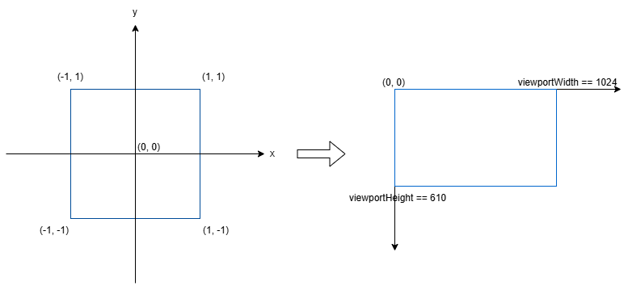
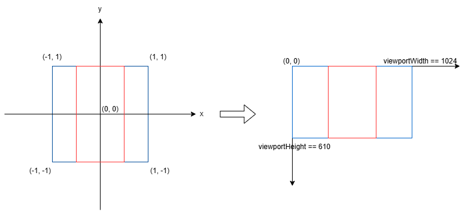
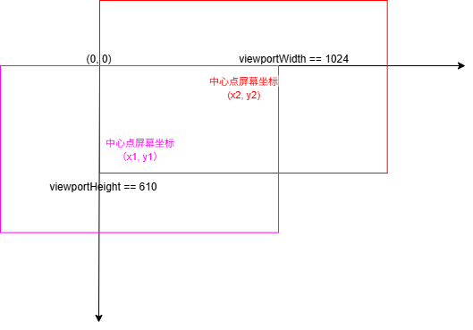
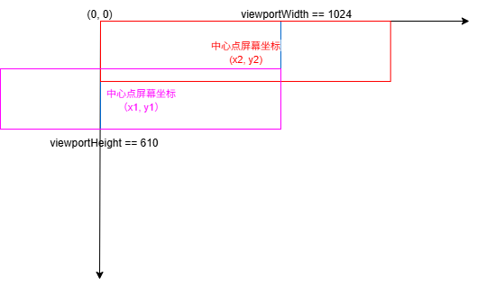
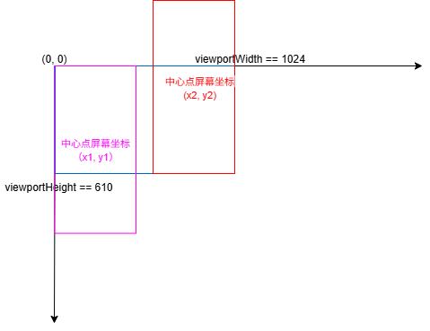

## 图片编辑

在图片尤其是视频编辑中，一般会把MVP矩阵初始化为单位矩阵（确切的说是把视图投影矩阵定义为单位矩阵，模型矩阵用于做旋转、缩放、镜像等操作）。并把用于展示图片/视频的正方形的顶点坐标和UV坐标定义为：
``` javascript
var vertices = [-1.0, -1.0, 0.0, 1.0, -1.0, 0.0, -1.0,  1.0, 0.0, 1.0,  1.0, 0.0];
var uv = [0.0, 0.0, 1.0, 0.0, 0.0, 1.0, 1.0, 1.0];
```
由于OpenGL 的渲染管线最终会将顶点坐标变换到 [-1, 1]³ 的归一化立方体空间（NDC），超出此范围的片段会被裁剪。

XYZ 坐标范围：X∈[-1,1], Y∈[-1,1], Z=0 。这正好覆盖了 NDC 空间的整个 XY 平面。

由于MVP矩阵是单位矩阵，顶点坐标经过 MVP 变换后保持不变，最终进入 NDC 的坐标仍然是原始值 (-1,-1,0) 到 (1,1,0)。

OpenGL 会将 NDC 坐标线性映射到视口（默认覆盖整个窗口）：

屏幕X = (NDC_X + 1) * (viewport_width / 2) + viewport_x

屏幕Y = (NDC_Y + 1) * (viewport_height / 2) + viewport_y

- 对于 NDC_X = -1 → 屏幕左边界

- NDC_X = 1 → 屏幕右边界

- 对于 NDC_Y = -1 → 屏幕下边界

- NDC_Y = 1 → 屏幕上边界

因此该四边形会严格匹配屏幕边缘。看起来就是图片和视频刚好完全撑满了整个屏幕/渲染View。

从坐标来看：



经过本文Demo的代码里的模型矩阵变换，表现如图所示：其中红色框代表当前默认图片通过fitCenter计算后所处的位置。



## 移动约束

在当前Demo中，不管加载多大的图片，最后会根据图片宽高比和viewport宽高比进行缩放，并居中显示（fitCenter）。如果图片不进行缩放，则固定位置不让移动。如果图片放大（不允许缩小<1.0倍），则让图片可以拖动，要求能显示图片的每个位置来看细节。这样就存在3种情况。

1. 缩放后图片宽和高都大于viewport宽高。

2. 缩放后图片宽大于viewportWidth,图片高小于viewportHeight。

3. 缩放后图片宽小于viewportWidth,图片高大于viewportHeight。

如何计算移动的约束？移动约束最终是要限制在OpenGL世界坐标中的tranX和transY的最大和最小值。图片缩放后的宽高和viewport的宽高是已知的。我们先根据这3种情况计算图片中心点左下的极限值和右上的极限值的屏幕坐标，再转换成OpenGL世界坐标。

可以把这3种情况归为如下图的三种情况：

#### 1. 缩放后图片宽和高都大于viewport宽高

如下图所示，这种情况下紫色长方形表示缩放的图片能往左下方向移动的极限值（再多往左下移动右上角就会留白），这种情况下缩放后的图片的右上角在屏幕（viewport）右上角。

反之，下图红色长方形表示缩放后的图片能往右上方向移动的极限值。这种情况下缩放后的图片的左下角在屏幕（viewport）左下角。

紫色长方形和红色长方形中心点的屏幕坐标分别为：

紫色长方形，图像右上角在屏幕右上角时的屏幕坐标（x1, y1）,就是代码中的：

const imgRightTopScreen = {
    x: (mViewportWidth - scaledDisplayedImgWidth / 2.0) ,
    y: scaledDisplayedImgHeight / 2.0
};

红色长方形，图像左下角在屏幕左下角时的屏幕坐标（x2, y2）,就是代码中的：

const imgLeftBottomScreen = {
    x: scaledDisplayedImgWidth / 2.0,
    y: (mViewportHeight - scaledDisplayedImgHeight / 2.0)
};



再把屏幕坐标转换成OpenGL世界坐标，即可得到transX和transY的最大和最小值。

#### 2. 缩放后图片宽大于viewportWidth,图片高小于viewportHeight

情况2类似，它们分别是紫色长方形是图片右下角在屏幕（viewport）右下角，红色长方形是图片左上角在屏幕（viewport）左上角。如图：
紫色长方形屏幕坐标（x1, y1）就是代码中的：

const imgRightBottomScreen = {
    x: (mViewportWidth - scaledDisplayedImgWidth / 2.0),
    y: (mViewportHeight - scaledDisplayedImgHeight / 2.0)
};

红色长方形屏幕坐标（x2, y2）就是代码中的：

const imgLeftTopScreen = {
    x: scaledDisplayedImgWidth / 2.0,
    y: scaledDisplayedImgHeight / 2.0
};



#### 3. 缩放后图片宽小于viewportWidth,图片高大于viewportHeight

情况3类似，它们分别是紫色长方形是图片左上角在屏幕（viewport）左上角，红色长方形是图片右下角在屏幕（viewport）右下角。如图：
紫色长方形屏幕坐标（x1, y1）就是代码中的：

const imgLeftTopScreen = {
    x: scaledDisplayedImgWidth / 2.0,
    y: scaledDisplayedImgHeight / 2.0
};

红色长方形屏幕坐标（x2, y2）就是代码中的：

const imgRightBottomScreen = {
    x: (mViewportWidth - scaledDisplayedImgWidth / 2.0),
    y: (mViewportHeight - scaledDisplayedImgHeight / 2.0)
};

