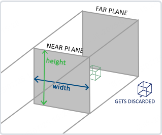
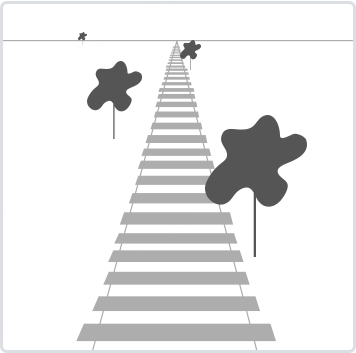
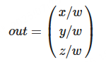
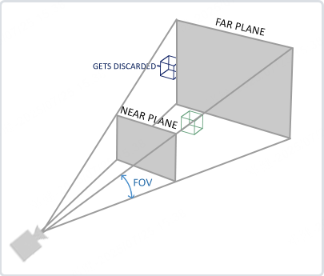
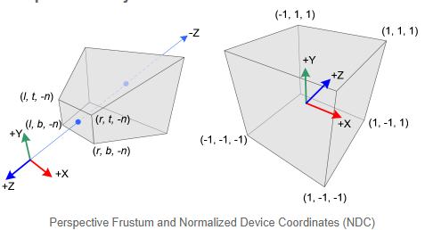
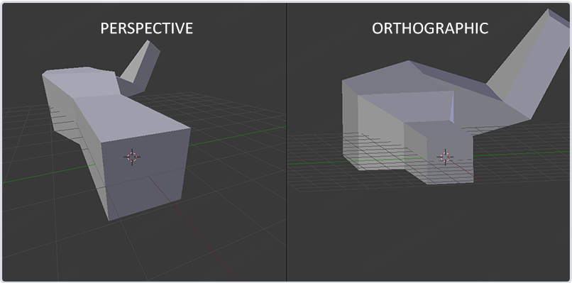
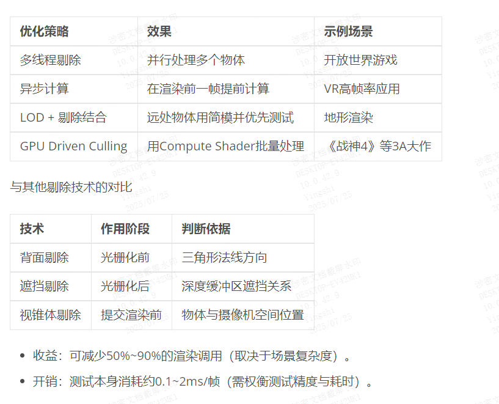

## 投影矩阵（Projection Matrix）（->裁剪空间）
在一个顶点着色器运行的最后，OpenGL期望所有的坐标都能落在一个特定的范围内，且任何在这个范围之外的点都应该被裁剪掉(Clipped)。被裁剪掉的坐标就会被忽略，所以剩下的坐标就将变为屏幕上可见的片段。这也就是裁剪空间(Clip Space)名字的由来。

因为将所有可见的坐标都指定在-1.0到1.0的范围内不是很直观，所以我们会指定自己的坐标集(Coordinate Set)并将它变换回标准化设备坐标系。

为了将顶点坐标从观察变换到裁剪空间，我们需要定义一个投影矩阵(Projection Matrix)，它指定了一个范围的坐标，比如在每个维度上的-1000到1000。投影矩阵接着会将在这个指定的范围内的坐标变换为标准化设备坐标的范围(-1.0, 1.0)。所有在范围外的坐标不会被映射到在-1.0到1.0的范围之间，所以会被裁剪掉。在上面这个投影矩阵所指定的范围内，坐标(1250, 500, 750)将是不可见的，这是由于它的x坐标超出了范围，它被转化为一个大于1.0的标准化设备坐标，所以被裁剪掉了。

<mark>如果只是图元(Primitive)，例如三角形，的一部分超出了裁剪体积(Clipping Volume)，则OpenGL会重新构建这个三角形为一个或多个三角形让其能够适合这个裁剪范围。</mark>

由投影矩阵创建的**观察箱**(Viewing Box)被称为视锥体(Frustum)，每个出现在视锥体范围内的坐标都会最终出现在用户的屏幕上。将特定范围内的坐标转化到标准化设备坐标系的过程（而且它很容易被映射到2D观察空间坐标）被称之为投影(Projection)，因为使用投影矩阵能将3D坐标投影(Project)到很容易映射到2D的标准化设备坐标系中。

一旦所有顶点被变换到裁剪空间，最终的操作——透视除法(Perspective Division)将会执行，在这个过程中我们将位置向量的x，y，z分量分别除以向量的齐次w分量；透视除法是将4D裁剪空间坐标变换为3D标准化设备坐标的过程。这一步会在每一个顶点着色器运行的最后被自动执行。

在这一阶段之后，最终的坐标将会被映射到屏幕空间中（使用glViewport中的设定），并被变换成片段。

将观察坐标变换为裁剪坐标的投影矩阵可以为两种不同的形式，每种形式都定义了不同的视锥体。我们可以选择创建一个正射投影矩阵(Orthographic Projection Matrix)或一个透视投影矩阵(Perspective Projection Matrix)。


## 正交投影

正射投影矩阵定义了一个类似立方体的视锥箱，它定义了一个裁剪空间，在这空间之外的顶点都会被裁剪掉。创建一个正射投影矩阵需要指定可见视锥的宽、高和长度。在使用正射投影矩阵变换至裁剪空间之后处于这个视锥的所有坐标将不会被裁剪掉。它的视锥来像一个容器：



上面的视锥体定义了可见的坐标，它由宽、高、近(Near)平面和远(Far)平面所指定。任何出现在近平面之前或远平面之后的坐标都会被裁剪掉。正射平视锥直接将视锥内部的所有坐标映射为标准化设备坐标，因为每个向量的w分量都没有进行改变；如果w分量等于1.0，透视除法则不会改变这个坐标。

要创建一个正射投影矩阵，我们可以使用GLM的内置函数`glm::ortho`：

```c++
glm::ortho(0.0f, 800.0f, 0.0f, 600.0f, 0.1f, 100.0f);
```

前两个参数指定了视锥体的左右坐标，第三和第四参数指定了平视锥的底部和顶部。通过这四个参数我们定义了近平面和远平面的大小，然后第五和第六个参数则定义了近平面和远平面的距离。这个投影矩阵会将处于这些x，y，z值范围内的坐标变换为标准化设备坐标。

正射投影矩阵直接将坐标映射到2D平面中，即你的屏幕，但实际上一个直接的投影矩阵会产生不真实的结果，因为这个投影没有将透视(Perspective)产生的近大远小的效果考虑进去。所以我们需要透视投影矩阵来解决这个问题。


## 透视投影

如果你曾经体验过**实际生活**给你带来的景象，你就会注意到离你越远的东西看起来更小。这个效果称之为透视(Perspective)。透视的效果在我们看一条无限长的高速公路或铁路时尤其明显，如图：



由于透视，这两条线在很远的地方看起来会相交。这正是透视投影想要模仿的效果，它是使用透视投影矩阵来完成的。这个投影矩阵将给定的视锥体范围映射到裁剪空间，除此之外还修改了每个顶点坐标的w值，从而使得离观察者越远的顶点坐标w分量越大。被变换到裁剪空间的坐标都会在-w到w的范围之间（任何大于这个范围的坐标都会被裁剪掉）。OpenGL要求所有可见的坐标都落在-1.0到1.0范围内，作为顶点着色器最后的输出，因此，一旦坐标在裁剪空间内之后，透视除法就会被应用到裁剪空间坐标上：



顶点坐标的每个分量都会除以它的w分量，距离观察者越远顶点坐标就会越小。这是w分量重要的另一个原因，它能够帮助我们进行透视投影。最后的结果坐标就是处于标准化设备空间中的。如果你对正射投影矩阵和透视投影矩阵是如何计算的很感兴趣可以参考Songho写的[文章](http://www.songho.ca/opengl/gl_projectionmatrix.html)。

在GLM中可以这样创建一个透视投影矩阵：

```c++
glm::mat4 proj = glm::perspective(glm::radians(45.0f), (float)width/(float)height, 0.1f, 100.0f);
```

同样，`glm::perspective`所做的其实就是创建了一个定义了可视空间的大**视锥体**，任何在这个视锥体以外的东西最后都不会出现在裁剪空间体积内，并且将会受到裁剪。一个透视视锥体以被看作一个不均匀形状的箱子，在这个箱子内部的每个坐标都会被映射到裁剪空间上的一个点。下面是一张透视视锥体图片：



从视锥体到NDC坐标变换如下：



它的第一个参数定义了fov的值，它表示的是视野(Field of View)，并且设置了观察空间的大小。如果想要一个真实的观察效果，它的值通常设置为45.0f。第二个参数设置了宽高比，由视口的宽除以高所得。第三和第四个参数设置了视锥体的**近**和**远**平面。我们通常设置近距离为0.1f，而远距离设为100.0f。所有在近平面和远平面内且处于视锥体内的顶点都会被渲染。

<mark>当你把透视矩阵的 *near* 值设置太大时（如10.0f），OpenGL会将靠近摄像机的坐标（在0.0f和10.0f之间）都裁剪掉，这会导致一个你在游戏中很熟悉的视觉效果：在太过靠近一个物体的时候你的视线会直接穿过去。</mark>

当使用正射投影时，每一个顶点坐标都会直接映射到裁剪空间中而不经过任何精细的透视除法（它仍然会进行透视除法，只是w分量没有被改变（它保持为1），因此没有起作用）。因为正射投影没有使用透视，远处的物体不会显得更小，所以产生奇怪的视觉效果。由于这个原因，正射投影主要用于二维渲染以及一些建筑或工程的程序(CAD)，在这些场景中我们更希望顶点不会被透视所干扰。某些如 *Blender* 等进行三维建模的软件有时在建模时也会使用正射投影，因为它在各个维度下都更准确地描绘了每个物体。下面你能够看到在Blender里面使用两种投影方式的对比：



你可以看到，使用透视投影的话，远处的顶点看起来比较小，而在正射投影中每个顶点距离观察者的距离都是一样的。

上面多次提到了视锥体（Frustum）这个概念。在游戏中，为了极致的性能，也避免过多不必要的DrawCall，会使用视锥体剔除（Frustum Culling）这个技术，即在CPU层面就通过数学计算把视锥体外的物体不提交DrawCall，这些已经被剔除的物体不会走到后面GPU的裁剪阶段。

