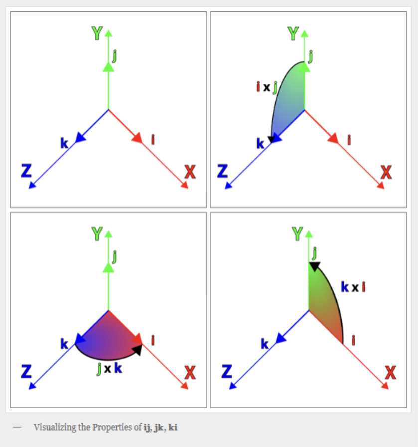

## 四元数
 - 四元数是一种数学表示，通常用四个值（w, x, y, z）来表示旋转。四元数避免了万向锁问题，并且在进行多个连续旋转时计算更为高效。
 - 四元数也可以很容易地与欧拉角和轴角之间进行转换。

四元数是一种扩展的数值类型，是一种简单的超复数，由实数加上三个虚数单位i、j和k组成‌。可以表示为：q = w + xi + yj + zk，其中：
 - w,x,y,z是实数部分；
 - i,j,k是虚数单位，满足 i^2 = j^2 = k^2 = ijk = -1 。
 - 在计算机图形学中，旋转用单位四元数表示，单位四元数满足： w^2 + x^2 + y^2 + z^2 = 1 。

为什么四元数能表示三维空间的旋转呢？首先学过高数我们都知道复数的定义以及几何意义，复数可以映射到复数平面上，并且对这复数乘以i，得到的复数就相当于复数空间里旋转了90度。将复数的虚部扩展为三个，并根据汉密尔顿的著名表达式以及推论:
 i^2 = j^2 = k^2 = ijk = -1
 ij = k     ji = -k
 jk = i     kj = -i
 ki = j     ik = -j
四元数的定义可以用来表达笛卡尔坐标系的旋转，其中i,j,k分别代表笛卡尔坐标系里xyz三个轴的单位向量。这些表达式里 ij = k 是不是很眼熟？两个互相垂直的单位向量的叉乘等于垂直于两个向量的单位向量。如图：

## 优点
四元数提供了一种方便且高效的方式来表示三维空间中的旋转，具体优点如下：

 - 避免万向锁：与欧拉角不同，四元数没有万向锁问题。这是由于四元数使用一种更为通用的旋转表示方法，从而规避了在某些特定角度的表示局限性。
 - 插值和平滑过渡：四元数可以用于平滑旋转过渡（如球形插值），这在动画和计算机图形应用中非常重要。
 - 计算效率：四元数的旋转计算比矩阵乘法速度快，因为它们只涉及较少的乘法和加法运算。
 - 紧凑表示：四元数使用四个数来表示旋转，而旋转矩阵需要九个数（对于 3x3 矩阵），因此在内存使用上更加高效。

## 缺点
 - 直观性不足：四元数的数学性质和表示方式可能对某些开发者或艺术家不够直观，理解旋转的直观可视化相比于欧拉角或旋转矩阵要难一些。
 - 非唯一性：同一个旋转可能由多个四元数表示。例如，四元数 q和−q 表示相同的旋转。
 - 初始化和转换成本：将欧拉角或旋转矩阵转换为四元数，或者从四元数转换回来，可能会引入额外的计算开销。
 - 累积误差：浮点数的表示会导致精度损失，特别是在进行大量旋转累积时。每次旋转可能引入少量误差，随着多次累积，这些误差最终可能成为明显的偏差。
 - 归一化：当进行多次旋转和更新四元数后，四元数可能会随着计算而失去单位四元数的性质（即应保持 w^2 + x^2 + y^2 + z^2 =1）。为了避免这种情况，通常会进行归一化，但归一化也会引入微小的误差，特别是在频繁调用的情况下。

如果要减少累积误差，可以：
 - 周期性归一化：在进行多次旋转计算时，定期归一化四元数以保持其单位长度。这可以帮助减少由于浮点误差导致的偏离。
 - 使用更高精度的数值类型：如果实际应用允许，可以使用双精度浮点数（double）替代单精度浮点数（float），以提高计算精度。
 - 减少不必要的旋转：优化场景中的旋转逻辑，避免在不必要的情况下进行频繁或冗余的旋转计算。
 - 重新计算旋转：在关键帧动画中，可以考虑周期性地重置物体的姿态，或使用其他方法来保持旋转的准确性。

