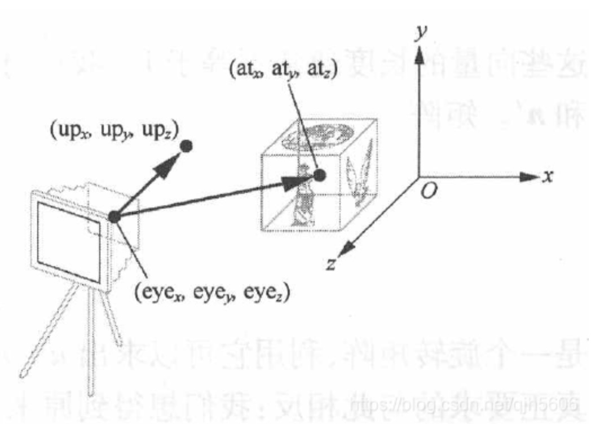
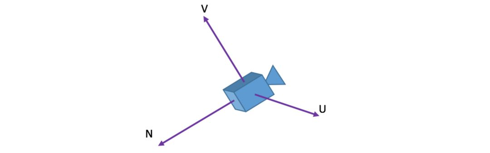
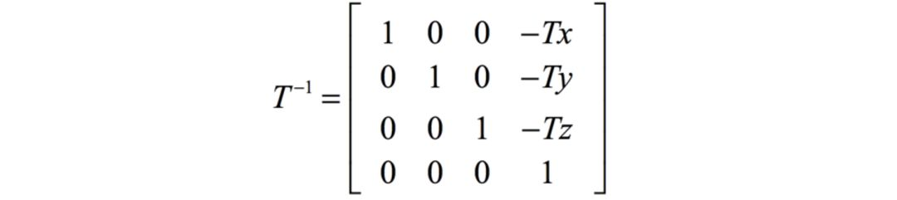
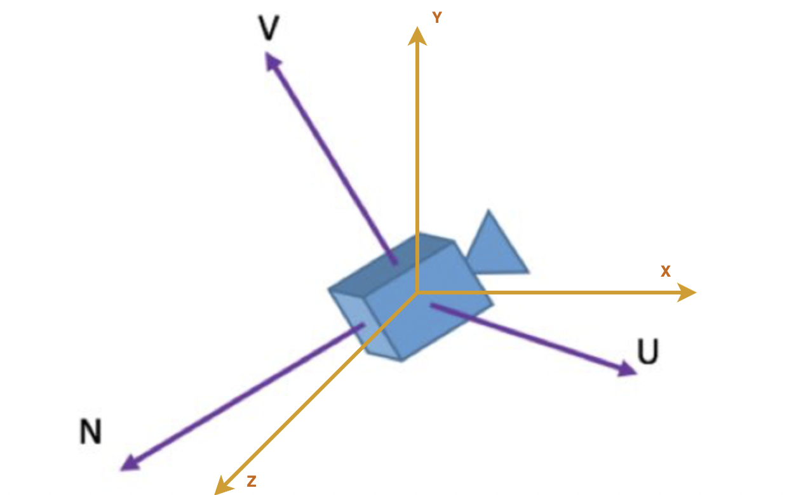
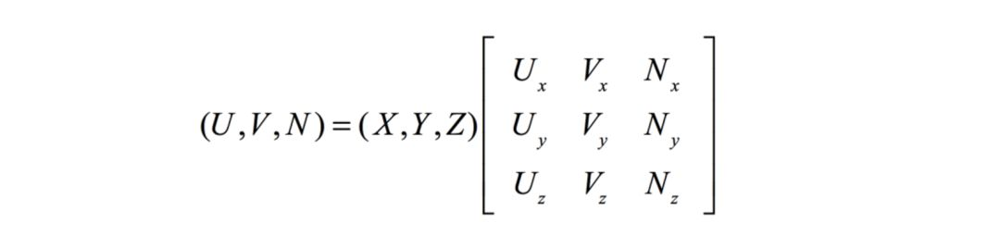
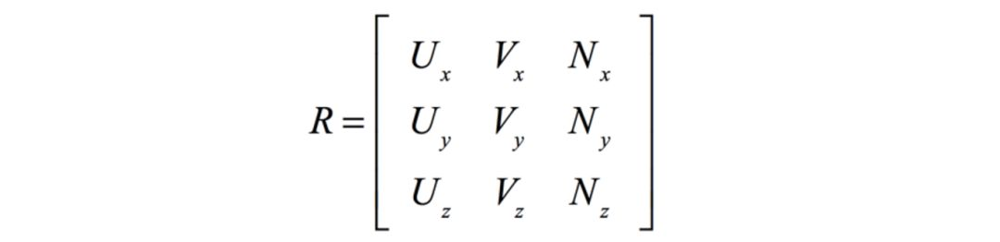
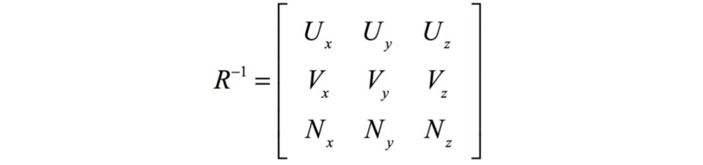
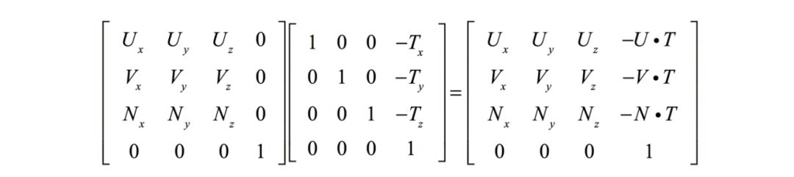

## 视图矩阵（View Matrix）
观察者的位置和方向会变化，看上去就好像整个世界的位置和方向发生变化了一样，所以解决的方案很简单，将世界里的所有模型看作一个大模型，在所有模型矩阵的左侧再乘以一个表示整个世界变换的模型矩阵，就可以了。这个表示整个世界变换的矩阵又称为“视图矩阵”，因为他们经常一起工作，所以将视图矩阵乘以模型矩阵得到的矩阵称为“模型视图矩阵”。<b>模型视图矩阵的作用是：乘以一个点坐标，获得一个新的点坐标，获得的点坐标表示：点在世界里变换，观察者也变换后，点相对于观察者的位置。</b>
视图矩阵实际上就是整个世界（观察者）的模型矩阵。

View矩阵可以由两个矩阵合成:

 - 一个是将摄像机平移至原点的矩阵T，
 - 一个是将坐标点从世界坐标系转换至摄像机坐标系的矩阵R

## 视图矩阵推导
前面提到过，视图矩阵对应Camera的位置、朝向的点坐标、以及Camera的上方向向量，我们先来看一张图： 

 - 视点：相机在世界坐标中的位置 eye(eyeX, eyeY, eyeZ)
 - 被观察的目标点. 指明相机的朝向 at(atX, atY,atZ)
 - 顶部朝向：确定在相机哪个方向是向上的，一般取(0, 1, 0) up(upX,upY, upZ)

下面我们来看看怎样通过Camera的位置、朝向的点坐标、以及Camera的上方向向量得到对应的View Matrix，首先给Camera定一个坐标系： 

NUV这三个向量是怎么来的呢？我们将Camera的坐标记为eye，朝向的点坐标记为lookat，上方向向量记为up，那么： 
 - N向量：eye - lookat 
 - U向量：up × N 并归一化 
 - V向量：N × U 并归一化 

我们要把Camera以某种姿态放在世界坐标系中的某个地方，这个放的过程就是对应Camera的旋转和平移，这里表示为TR，其中T表示平移变换矩阵，R表示旋转变换矩阵。 我们虽然设置的是Camera，但最终动的是点坐标，因为Camera压根就不存在，是一个假想的东西。<b>假设我们不动摄像机，动坐标点，那么对坐标点的变换就应该是对相机变换的逆变换R^(-1)T^(-1)（就是对TR整体求逆矩阵）。</b>
即相机变换矩阵M = T * R	视图矩阵M-1 = (T * R)^(-1) = R^(-1) * T^(-1)

注意，这里的R^(-1)T^(-1)看起来貌不惊人，实际上就是我们要求的View Matrix。 根据前面的知识，我们能很容易得到T^(-1): 

这个直观上也好理解，比如本来是平移Tx，逆过来就是平移-Tx，依此类推。 再回顾一下我们的目标R^-1T^-1，现在还差R^-1，现在再次回到我们假想的Camera，前面说要对它做TR，当做完R后，Camera会旋转至某个姿态： 

XYZ和UVN都可以看成是一组基，根据线性代数公式可将一个点在XYZ基下的坐标转成在UVN基下的坐标，R就相当于是把基XYZ变换成UVN的变换矩阵，其中： 

X = (1, 0, 0), Y = (0, 1, 0), Z = (0, 0, 1)

假设： T表示转置

U = （Ux, Uy, Uz）^T,  
V = （Vx, Vy, Vz）^T,  
N = （Nx, Ny, Nz）^T, 

则有： 

于是： 

由于R是正交矩阵，有性质：R^-1=R^T（R^T代表R的转置），为什么R是正交矩阵？ Tips:方阵A正交的充要条件是A的行（列) 向量组是单位正交向量组。 于是：

现在我们T^-1和R^-1都有了，R^-1T^-1也就是最终的View Matrix可以很容易地计算出来了，因为OpenGL中坐标是4维的，所以这里将矩阵写成4*4的：

